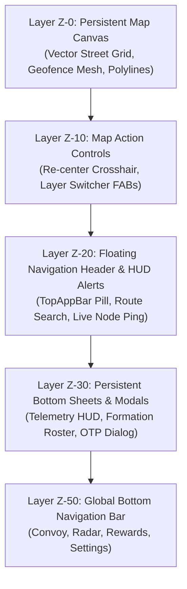
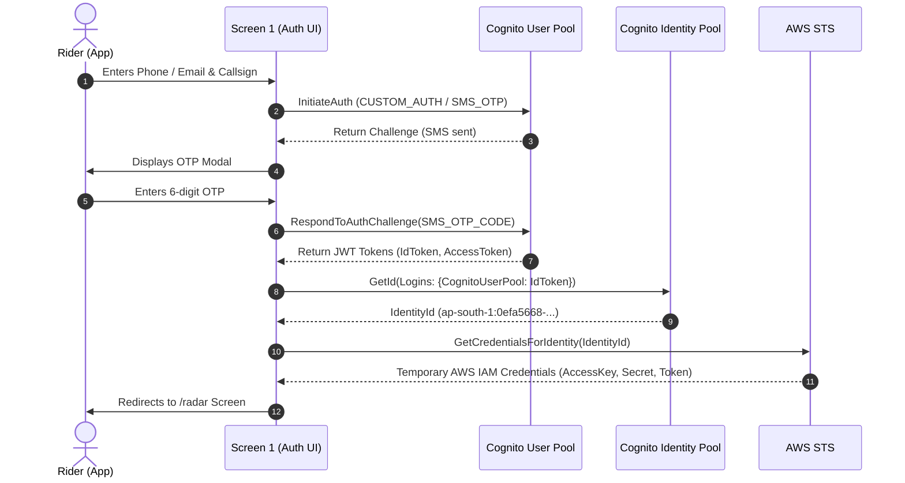

# GroupNav UI & Client Implementation Plan
### Bharat Builds Tour — Frontend Architecture & Backend Integration Guide

**Version:** 1.0  
**Owner:** Mobile / Frontend Engineering Team  
**Audience:** Flutter & Web engineers building the client UI, Backend engineers validating contract endpoints  
**Reference Source:** [`groupnav_template.md`](file:///d:/chirag/GroupNav-Infrastructure/groupnav_template.md), [`groupnav_ui.zip`](file:///d:/chirag/GroupNav-Infrastructure/groupnav_ui.zip), and [`client-config.json`](file:///d:/chirag/GroupNav-Infrastructure/client-config.json)

---

## 1. Executive Summary & Design Philosophy

GroupNav is a real-time group location-tracking and convoy coordination client. Riders publish high-frequency GPS telemetry over encrypted MQTT, backend compute engines process positional consensus in Redis and store historical journeys in Aurora PostGIS, and the client renders dynamic spatial orientation on vector cartography.

The UI adheres strictly to the **"Convoy Telemetry" Design System** ([`groupnav_template.md`](file:///d:/chirag/GroupNav-Infrastructure/groupnav_template.md)):
- **Zero-Clutter Utility:** Full-bleed interactive cartography operates as an infinite canvas (Z-0) overlaid by floating, high-contrast, pure-white cards (Level 1–3 elevations) and tactile pill controls.
- **Glanceability Under Glare:** High-contrast slate typography (`#1A1D20`), electric blue primary navigation vectors (`#0066FF`), telemetry emerald status indicators (`#00C48C`), and route cyan highlights (`#00D4FF`).
- **Direct Cloud Integration:** No intermediary proxy servers. The client authenticates via **Amazon Cognito**, obtains scoped temporary **AWS STS IAM credentials**, and talks directly to **Amazon Location Service** for vector map tiles/geofences and **AWS IoT Core** over SigV4 WebSockets for MQTT telemetry.

---

## 2. Global Design System & Component Foundation

### 2.1 Color Palette & Token Hierarchy

| Token Name | Hex Code | Purpose & Usage |
|:---|:---|:---|
| **Primary** | `#0066FF` / `#0050CB` | Active navigation vectors, primary CTA buttons, selected tabs, focus rings. |
| **Telemetry Emerald** | `#00C48C` | Verified node pings, within-bounds geofence status, reward indicators. |
| **Route Cyan** | `#00D4FF` | Glowing polyline core, intermediate checkpoints, route secondary accents. |
| **Alert Warning** | `#FF9500` | Geofence proximity warnings, lagging convoy participants, retry states. |
| **Alert Critical** | `#FF3B30` | Geofence boundary breaches, GPS lock loss, destructive actions (Sign Out). |
| **Surface / Background**| `#FAF8FF` | App backdrop and canvas undertones. |
| **Card BG (Pure White)**| `#FFFFFF` | Floating cards, modals, and bottom sheets hovering over map tiles. |
| **Map Surface** | `#F4F6F8` | Base neutral vector map styling background. |
| **Text Primary** | `#1A1D20` | High-contrast body, headlines, and data readouts. |
| **Text Secondary** | `#636A73` | Metadata, micro-labels, and subtitle text. |
| **Border Subtle** | `#E5E8EB` | Card dividers, 1px card outlines, and segmented control containers. |

### 2.2 Typography Scale (Inter Font Family)

| Style Token | Font Size / Line Height | Weight & Tracking | Component Application |
|:---|:---|:---|:---|
| `headline-xl` | 32px / 40px | 700 (Bold), -0.02em | Splash banners, primary modal headers. |
| `headline-lg` | 24px / 32px | 600 (SemiBold), -0.015em | Screen titles, formation titles, page headers. |
| `headline-md` | 20px / 28px | 600 (SemiBold), -0.01em | Card headers, section titles. |
| `body-lg` | 16px / 24px | 400 (Regular) | Primary descriptive paragraphs, form inputs. |
| `body-md` | 14px / 20px | 400 (Regular) | Secondary descriptive text, list subtitles. |
| `body-sm` | 12px / 16px | 400 (Regular) | Helper text, timestamps, metric units. |
| `label-lg` | 14px / 20px | 600 (SemiBold), +0.01em | Primary button labels, input field labels. |
| `label-md` | 12px / 16px | 600 (SemiBold), +0.02em | Segmented toggles, badge chips, button subtitles. |
| `label-sm` | 11px / 14px | 700 (Bold), +0.04em | Micro-badges, uppercase status chips, tag pills. |
| `telemetry-num`| 18px / 22px | 700 (Bold), -0.02em | Tabular speed, elevation, distance, and metrics. |

### 2.3 Spatial Layering (Z-Index Architecture)



### 2.4 Shared Shell Components

1. **Floating Top Navigation Bar (`TopAppBar`)**:
   - 52px floating pill anchored to safe-area top with Level 2 shadow (`0 4px 12px -2px rgba(15, 23, 42, 0.08)`).
   - Left: Drawer toggle / back arrow + Brand Moniker ("GroupNav DePIN").
   - Center: Active route indicator or operational badge.
   - Right: Live telemetry node status ping (`#00C48C` pulsing dot) + Token reward counter (`+4.2 NAV/hr`).
2. **Persistent Global Bottom Navigation Bar (`BottomNavBar`)**:
   - 56px fixed dock anchored to viewport bottom with 4 primary destinations:
     - **Tab 0: Convoy** (`/convoy` or `/groups` — Pack Management & Formations)
     - **Tab 1: Radar** (`/radar` — Real-Time Live Map & HUD Broadcast)
     - **Tab 2: Trips** (`/trips` — Aurora PostGIS History & Replay)
     - **Tab 3: Settings** (`/settings` — Telemetry Preferences & AWS Identity)
   - Active state displays filled Material Symbol icon in `#0066FF`, bold label, and scale elevation.

---

## 3. Client Architecture & Implementation Phases

```
┌──────────────────────────────────────────────────────────────────────────────────┐
│                             CLIENT APPLICATION SHELL                             │
│                                                                                  │
│   Phase 1: Foundation      Phase 2: Auth & Session     Phase 3: Live Radar       │
│   ┌──────────────────┐     ┌─────────────────────┐     ┌───────────────────────┐ │
│   │ Design Tokens &  │ ──► │ Pilot Onboarding    │ ──► │ MapLibre + IoT Core   │ │
│   │ Map Shell Setup  │     │ AWS Cognito Auth    │     │ Real-Time Broadcast   │ │
│   └──────────────────┘     └─────────────────────┘     └───────────────────────┘ │
│                                                                   │              │
│                                                                   ▼              │
│   Phase 6: Observability   Phase 5: Trip Analytics     Phase 4: Pack Formation  │
│   ┌──────────────────┐     ┌─────────────────────┐     ┌───────────────────────┐ │
│   │ CloudWatch /     │ ◄── │ Aurora PostGIS      │ ◄── │ Location Service      │ │
│   │ IoT Live Console │     │ Trip Replay & LiDAR │     │ Geofence Mesh & Code  │ │
│   └──────────────────┘     └─────────────────────┘     └───────────────────────┘ │
└──────────────────────────────────────────────────────────────────────────────────┘
```

| Phase | Screen / Feature Area | Primary Backend Resource | Key Deliverable |
|:---|:---|:---|:---|
| **Phase 1** | Client Setup & Configuration | `client-config.json` | Config loader, theme tokens, HTTP & SigV4 clients |
| **Phase 2** | Pilot Auth & Onboarding (`/auth`) | Cognito User Pool & Identity Pool | Phone/Email OTP login, credentials store, vehicle setup |
| **Phase 3** | Live Group Radar & HUD (`/radar`) | Amazon Location + IoT Core + Redis | Live vector map, MQTT telemetry broadcast, speed HUD |
| **Phase 4** | Pack Management (`/groups`) | Location Geofence Collection + DynamoDB | Group invite code, QR share, dynamic radius slider |
| **Phase 5** | Trip History & Replay (`/trips`) | Aurora Serverless v2 PostgreSQL | Replay scrubber, LiDAR elevation profile, GPX export |
| **Phase 6** | Operational Telemetry (`/telemetry`)| CloudWatch Logs & Metrics API | Live MQTT packet stream console, health metrics |

---

## 4. Phase 1 — Client Setup & Backend Configuration Loading

### 4.1 Configuration Ingestion
The client never hardcodes AWS ARNs or endpoints. It bundles or fetches [`client-config.json`](file:///d:/chirag/GroupNav-Infrastructure/client-config.json), generated by CDK outputs during infrastructure deployment:

```json
{
  "region": "ap-south-1",
  "cognito": {
    "userPoolId": "ap-south-1_JoK8Zlj1x",
    "userPoolClientId": "4ko1153kp0hl7q7oa402cqiqfi",
    "identityPoolId": "ap-south-1:0efa5668-5ed9-4ee6-9120-86f8cc2ae4cd"
  },
  "location": {
    "mapName": "GroupNavMap",
    "geofenceCollectionName": "GroupNavGeofenceCollection"
  },
  "iot": {
    "endpoint": "a362o0ub4ypzaj-ats.iot.ap-south-1.amazonaws.com"
  },
  "compute": {
    "telemetryTopicPattern": "groupnav/{riderId}/telemetry"
  }
}
```

### 4.2 Security Architecture & Credentials Lifecycle
1. User logs in via **Cognito User Pool** (`ap-south-1_JoK8Zlj1x`).
2. Client receives Cognito JWT tokens (`IdToken`, `AccessToken`, `RefreshToken`).
3. Client exchanges `IdToken` with **Cognito Identity Pool** (`ap-south-1:0efa5668-5ed9-4ee6-9120-86f8cc2ae4cd`) via AWS STS `GetCredentialsForIdentity`.
4. Resulting **AWS Temporary Credentials** (`AccessKeyId`, `SecretKey`, `SessionToken`, expiration 1hr) are stored securely in device hardware keystore (Keychain / EncryptedSharedPreferences).
5. Automatic refresh hook intercepts token expiry and transparently refreshes credentials without interrupting real-time MQTT streams.

---

## 5. Phase 2 — Screen 1: Pilot Authentication & Onboarding (`/auth`)

### 5.1 UI Breakdown (Based on `auth_onboarding_auth`)
- **Map Backdrop (Z-0):** Subtle dark ambient vector grid (`#0D1117`) with animated glowing arterial routes.
- **Header Floating Pill (Z-20):** Displays "GroupNav DePIN" with live node status chip (`NODE 01`, `99.8%` signal).
- **Authentication Card (Z-30):**
  - High-elevation card (`0 12px 32px -4px rgba(15, 23, 42, 0.14)`).
  - AWS Cognito Connected status badge with telemetry emerald dot.
  - Form Fields:
    - **Phone Number / Email Input:** Validated format with instant checkmark badge.
    - **Tactical Callsign:** Text field (e.g. `0xApex`, `GhostLead`) mapped to the rider's identity tag.
  - **Submit Button:** `Continue with OTP` (`#0066FF`, active scale `0.98`).
- **Vehicle Class Staging Selector:**
  - 4 tactile segmented pills: **Sportbike** (active), **Adventure**, **Touring**, **Cruiser**.
- **HUD Beacon Color Swatch:**
  - Swatches: Cyan (`#00D4FF`), Electric Blue (`#0066FF`), Amber (`#FF9500`), Emerald (`#00C48C`).
- **OTP Verification Dialog (Modal Overlay):**
  - Backdrop blur (`rgba(46, 48, 58, 0.60)`).
  - 6-digit split OTP input boxes with active pulsing cursor.
  - Countdown timer (`Resend in 0:42`) and SMS verification target readout.
  - `Verify & Connect Fleet` CTA button.
  - Bottom indicator showing authenticated Cognito Session ID.

### 5.2 Backend Integration Mechanics



### 5.3 Verification Step
1. Enter test phone/email. Verify that Cognito triggers an SMS OTP code.
2. Enter the OTP in the modal. Verify that `aws sts get-caller-identity` returns an IAM ARN belonging to `CognitoIdentityCredentials`.
3. Confirm that temporary credentials successfully persist across app restarts.

---

## 6. Phase 3 — Screen 2: Live Group Radar & Convoy HUD (`/radar`)

### 6.1 UI Breakdown (Based on `live_group_radar_radar`)
- **Interactive Full-Bleed Map Canvas (Z-0):**
  - Powered by **MapLibre GL** consuming vector tiles from Amazon Location Service (`GroupNavMap`).
  - Rendered with high-contrast road grid and 800m circular dashed geofence boundary mesh.
  - Glowing multi-stop polyline route (`#0066FF` glow with `#00D4FF` core).
- **Convoy Participant Markers:**
  - **Leader (Current User):** High-prominence avatar with electric blue heading vector arrow, pulsing radar ripple, and moniker tag `Leader: Apex (HQ)`.
  - **Peer Riders:** Micro-pins with relative distance offsets (`Viper: +120m` in emerald, `Ghost: -85m` in amber).
- **Floating Controls (Z-10 & Z-20):**
  - **Top Search Pill:** Shows active route name (`Skyline Summit`), live $NAV token reward counter (`142.8 $NAV`), and pilot wallet ref (`0x7F2`).
  - **Right Floating Action Buttons (FAB):** Layer toggle (`layers`) and Re-center crosshair (`my_location`).
- **Docked Telemetry HUD Bottom Sheet (Z-30):**
  - Drag handle indicator pill.
  - **Bento Metric Strip (4 cards):**
    1. **Speed:** Tabular numeral (e.g. `78 km/h`).
    2. **Heading:** Cardinal direction + bearing (e.g. `NE 042°`).
    3. **Elevation:** Tabular meters (e.g. `312 meters`).
    4. **Pack Cohesion:** Cohesion score percentage + status (e.g. `98% TIGHT`).
  - **AWS IoT Core MQTT Live Broadcast Controller Card:**
    - Live pulsing emerald indicator.
    - Status label: `Online / Broadcasting (QoS 1)`.
    - Hardware toggle switch to start/pause live telemetry broadcast.

### 6.2 Backend Integration Mechanics

```mermaid
flowchart TD
    subgraph Device [Mobile Client /radar]
        GPS[Device GPS Stream 5Hz] --> Builder[Telemetry JSON Packager]
        Builder --> WSS[MQTT WebSocket Client]
        ML[MapLibre Map View] <-- GeoJSON[Dynamic GeoJSON Source]
    end

    subgraph AWS [AWS Cloud ap-south-1]
        WSS -- SigV4 Signed WSS --> IoT[AWS IoT Core ATS Endpoint]
        IoT -- Topic: groupnav/{riderId}/telemetry --> Rule[IoT SQL Topic Rule]
        Rule --> Lambda[groupnav-process-telemetry]
        Lambda --> Redis[(ElastiCache Redis GEOADD)]
        Lambda --> Aurora[(Aurora PostgreSQL PostGIS)]
        Redis -- Spatial Calc: Distance & Cohesion --> PubBack[IoT Publish Topic]
        PubBack -- Topic: groupnav/convoy/{packId}/positions --> WSS
    end

    WSS --> GeoJSON
```

#### Telemetry Payload Schema (`groupnav/{riderId}/telemetry`):
```json
{
  "riderId": "ap-south-1:0efa5668-5ed9-4ee6-9120-86f8cc2ae4cd",
  "callsign": "0xApex",
  "packId": "804",
  "latitude": 37.774929,
  "longitude": -122.419416,
  "altitude": 312.4,
  "speedKmh": 78.2,
  "headingDeg": 42.0,
  "accuracy": 4.5,
  "timestamp": 1729012391000
}
```

#### Amazon Location Service Map Tile Signing:
- The client uses the AWS SDK for JavaScript / Dart to compute a SigV4 signed URL for Amazon Location Service map tiles:
  `https://maps.geo.ap-south-1.amazonaws.com/maps/v0/maps/GroupNavMap/tiles/{z}/{x}/{y}`
- Tiles load directly into the MapLibre GL raster/vector source using authenticated temporary credentials without a reverse proxy.

### 6.3 Verification Step
1. Toggle the "Broadcasting" switch ON.
2. Confirm the device GPS coordinates publish to `groupnav/<cognito-sub>/telemetry`.
3. Open AWS IoT Core Console test client; verify messages appear with QoS 1.
4. Verify that peer positions render on the MapLibre canvas with smooth coordinate interpolation.

---

## 7. Phase 4 — Screen 3: Pack Management & Formation (`/groups`)

### 7.1 UI Breakdown (Based on `pack_management_groups`)
- **Pack Header:** Pack title (e.g. `Pack Formation #804`), Active Telemetry Sync badge, and native share button.
- **Active Group Code Card:**
  - Monospace high-visibility code box (`GN-9482`) with one-touch `Copy` button.
  - `Pair QR` action button launching in-person camera QR code scanner.
- **Collapsed Mini-Map Preview:**
  - Vector cluster showing relative radar positions of all active pack members inside the geofence perimeter.
  - `Expand Map` button navigating directly to `/radar`.
- **Dynamic Geofence Slider Widget:**
  - Title: `Pack Geofence Radius`.
  - Current value readout badge (e.g. `850m` or `1.5km`).
  - Interactive slider track (200m to 5,000m in steps of 50m).
  - Bound markers: `200m (Tight)` to `5.0km (Highway)`.
- **Pack Roster (Rider Cards):**
  - **Apex (You / Flagship):** Verified Node badge, Leader tag, 78 km/h.
  - **Viper:** Verified node, `+120m` ahead, 72 km/h.
  - **Ghost:** ` -85m` behind, 68 km/h, trailing in-bounds.
  - **Nomad:** `+410m` lagging, status highlighted with warning pill.
- **Emergency Action Buttons:**
  - `Broadcast Ping to All` (Audio/Haptic chime to all convoy participants).
  - `Disband Convoy` (Leader action to close formation).

### 7.2 Backend Integration Mechanics
1. **Group Code Generation & Pairing:**
   - Group metadata is tracked in the backend database. Creating a pack generates a human-readable 6-character code (`GN-9482`) and QR code data matrix payload:
     `{"action":"join_pack","code":"GN-9482","packId":"804"}`.
2. **Amazon Location Service Geofence Collection Updates:**
   - When the leader adjusts the radius slider, the client sends a geofence update to the backend API:
     ```json
     {
       "packId": "804",
       "radiusMeters": 850,
       "center": [-122.4194, 37.7749]
     }
     ```
   - Backend calls `PutGeofence` on `GroupNavGeofenceCollection` (`arn:aws:geo:ap-south-1:325313611329:geofence-collection/GroupNavGeofenceCollection`).
3. **Breach Alerts:**
   - When any rider's location crosses the geofence polygon/circle, Amazon EventBridge triggers an IoT publish event to `groupnav/convoy/804/alerts`, rendering an amber HUD toast on all member devices.

### 7.3 Verification Step
1. Create a pack and join from a second simulator/device using group code `GN-9482`.
2. Move the slider to `1,200m`. Verify that the backend geofence polygon expands.
3. Simulate GPS coordinates outside 1,200m; confirm an instant geofence breach alert arrives.

---

## 8. Phase 5 — Screen 4: Rider Settings & Infrastructure (`/settings`)

### 8.1 UI Breakdown (Based on `rider_settings_settings`)
- **Profile Summary Header:** Rider callsign, active DePIN node badge.
- **Telemetry Controls Section:**
  - **GPS Update Rate:** 3-way segmented control: `1 Hz (Battery Saver)`, `5 Hz (Balanced)`, `10 Hz (Pro Convoy)`.
  - **Background Broadcast:** Switch allowing continuous telemetry when app is minimized (with foreground service permission).
  - **High-Precision Geofence Alert:** Haptic & audio warning toggle when rider deviates >15m from convoy lane.
- **Map & Display Section:**
  - **Units System:** Metric (`km/h`, `meters`) vs Imperial (`mph`, `feet`).
  - **Map Theme:** Day, Night, Auto System.
  - **Cohesion Ping Audio Alert:** Spatial stereo audio pulse indicating pack proximity.
- **AWS Cloud & DePIN Identity Section:**
  - Staked token telemetry balance card (`142.8 $NAV`, `+4.2 NAV/hr active`).
  - Wallet reference pill (`0x7F2...9A3`).
  - **Cognito Identity ID:** Monospace display of the assigned AWS Cognito Identity ID with copy button.
  - **IAM Role ARN:** Scoped telemetry role ARN display with lock icon.
- **Destructive Action:**
  - `Sign Out of Cognito Session` button with confirmation prompt.

### 8.2 Backend Integration Mechanics
- **GPS Sampling Adjustment:**
  - Selecting `5 Hz` updates the native location stream parameters:
    `distanceFilter: 2.0`, `intervalDuration: 200ms`, `desiredAccuracy: high`.
- **Session Termination (`Sign Out`):**
  1. Calls `CognitoAuth.signOut()`.
  2. Disconnects active AWS IoT Core MQTT socket gracefully (`DISCONNECT` packet).
  3. Purges cached STS temporary credentials from device secure storage.
  4. Resets app state and routes back to `/auth`.

### 8.3 Verification Step
1. Switch rate from 5 Hz to 1 Hz; verify in terminal logs that outgoing MQTT message rate decreases to 1 packet per second.
2. Click "Sign Out". Verify the client drops the MQTT connection and redirects to the authentication screen.

---

## 9. Phase 6 — Screen 5: Trip History & Spatial Analytics (`/trips`)

### 9.1 UI Breakdown (Based on `trip_history_analytics_trips`)
- **Header:** `Aurora Spatial Ledger` indicator, screen title `Trip History`, and session month filter (`Replay: Oct 2024`).
- **Interactive Replay Map (Z-0 & Z-10):**
  - High-resolution cartographic view displaying complete past trip vector path.
  - Start waypoint pin, intermediate convoy checkpoint pin (`CP-2`), and Finish flag pin.
  - Floating playback control bar: Play/Pause button, elapsed time tracker (`01:42:10 / 02:18:00`), and speed multiplier pill (`1.5x Replay`).
- **Spatial Elevation & Pace Chart Card:**
  - `LiDAR Mesh` badge.
  - Key Metric Triad: **Max Speed** (`112 km/h`), **Avg Pace** (`64 km/h`), **Climb** (`+1,240m`).
  - SVG Area & Line Chart: Dual-axis chart rendering elevation profile (0m to 850m) filled with subtle blue gradient, overlaid with dashed cyan/emerald speed line.
  - Interactive scrub pointer updating cursor values (`Cursor: 68km • 620m • 84 km/h`).
- **Recorded Convoys List:**
  - Cards showing historical sessions (e.g. *Pacific Coast Highway*, *Monterey to Big Sur*).
  - Export actions: Download `GPX` or `GeoJSON`.

### 9.2 Backend Integration Mechanics
- **Aurora Serverless v2 PostgreSQL / PostGIS Spatial Queries:**
  - Historical coordinates written by `processTelemetry` Lambda are stored as `geometry(PointZ, 4326)`.
  - When the user opens a trip, the client executes an authenticated HTTPS REST request:
    `GET /trips/{tripId}`
  - Backend executes PostGIS query:
    ```sql
    SELECT 
      trip_id,
      ST_AsGeoJSON(trip_geom) AS geojson_route,
      ST_Length(trip_geom::geography) / 1000.0 AS distance_km,
      max_speed_kmh,
      avg_speed_kmh,
      elevation_profile_json
    FROM groupnav_trips
    WHERE rider_id = :riderId AND trip_id = :tripId;
    ```
  - The client parses the GeoJSON linestring into MapLibre GL polyline coordinates and populates the SVG elevation chart.

### 9.3 Verification Step
1. Fetch historical trip via the API.
2. Verify the map polyline renders matching the recorded GPS coordinates.
3. Drag the replay scrubber; verify the avatar moves along the polyline in sync with the elevation chart scrub line.

---

## 10. Phase 7 — Screen 6: Live Pipeline Health & Observability (`/telemetry`)

### 10.1 UI Breakdown (Based on `pipeline_health_telemetry`)
- **Header:** `GroupNav OPS` badge, live latency counter (`14ms`), pilot wallet avatar.
- **Operational Status Card:**
  - Status indicator: `Telemetry Core: Healthy` with pulsing emerald dot.
  - Region tag: `ap-south-1`.
- **2x2 CloudWatch Metrics Grid:**
  1. **Lambda Invocations:** `4,820/min` with mini green sparkline.
  2. **Redis Memory:** `412 MB / 1.5 GB` (27% load bar).
  3. **DLQ Message Depth:** `0 Messages` (Buffer state: Optimal).
  4. **MQTT Ingest Throughput:** `1,240 pkts/sec` (QoS 1).
- **Live MQTT Feed Console (Dark Technical Terminal):**
  - macOS-style terminal dots (red, yellow, green).
  - Title: `mqtt-broker::stream-in` (LIVE indicator).
  - Monospace scrolling log of raw JSON payloads and heartbeat acknowledgments (`[AWS-IOT] ACK client_id="convoy-edge-mesh-804"`).
  - Buffer counter: `buffer: 124 pkts - SYNCED`.
- **CloudWatch Link Button:**
  - Direct external CTA: `Open AWS CloudWatch Operational Dashboard`.

### 10.2 Backend Integration Mechanics
- **Metrics Data Source:**
  - Fetched via Amazon CloudWatch `GetMetricData` API using authenticated client role:
    - `AWS/Lambda` $\rightarrow$ `Invocations`, `Duration`, `Errors`
    - `AWS/ElastiCache` $\rightarrow$ `BytesUsedForCache`, `CPUUtilization`
    - `AWS/SQS` $\rightarrow$ `ApproximateNumberOfMessagesVisible`
    - `AWS/IoT` $\rightarrow$ `PublishIn.Success`
- **Live MQTT Stream:**
  - The client subscribes to `groupnav/+/telemetry` or a designated developer stream topic via the active WebSocket connection to pipe incoming packets directly into the terminal UI widget.

### 10.3 Verification Step
1. Publish a test MQTT packet from the command line or phone.
2. Verify that the packet renders instantly in the terminal console widget with sub-second latency.
3. Verify that the CloudWatch dashboard link opens the deployed dashboard (`GroupNav-Observability-Dashboard`).

---

## 11. Client-Backend Integration Matrix

| Client Screen | Path | Visual Components | Backend Service | Connection Protocol | Scoped IAM Action |
|:---|:---|:---|:---|:---|:---|
| **1. Auth & Onboarding** | `/auth` | Phone/Email input, OTP Modal, Callsign, Vehicle selector | **Amazon Cognito** | HTTPS / REST (Cognito IDP API) | `cognito-idp:InitiateAuth`, `cognito-identity:GetCredentialsForIdentity` |
| **2. Live Radar & HUD** | `/radar` | MapLibre vector map, 800m geofence ring, Speed/Heading/Pack Status HUD, Quick status alerts | **Amazon Location Service**, **AWS IoT Core**, **Redis** | HTTPS (Vector Tiles) + WSS MQTT over TLS (SigV4) | `geo:GetMapTile`, `geo:GetMapGlyphs`, `iot:Connect`, `iot:Publish` |
| **3. Pack Formation** | `/groups` | Group code `GN-9482`, QR code, Geofence radius slider, Member roster, SOS Broadcast | **Amazon Location Service**, **Backend API / DynamoDB** | HTTPS REST / GraphQL | `geo:PutGeofence`, `geo:GetGeofence` |
| **4. Rider Settings** | `/settings` | Profile & identity, ride alerts, units/theme, location & privacy, Leave Pack / Sign Out | **Amazon Cognito**, **Device Keystore** | Local IPC + HTTPS | `cognito-idp:GlobalSignOut` |
| **5. Trip History** | `/trips` | Replay scrubber (1.5x), LiDAR elevation chart, GPX/GeoJSON export | **Aurora Serverless v2 PostgreSQL (PostGIS)** | HTTPS REST / Aurora Data API | Scoped API Gateway query execution |

*(Note: Pipeline Health (`/telemetry`) was retired from the client application per product direction as operational infrastructure telemetry is managed via AWS CloudWatch directly).*

---

## 12. Complete UI Implementation Checklist

- [x] **Phase 1: Foundation & Setup**
  - [x] Bundle and test loading of [`client-config.json`](file:///d:/chirag/GroupNav-Infrastructure/client-config.json).
  - [x] Implement design system tokens (`colors`, `typography`, `elevation`, `spacing`) from [`convoy_telemetry/DESIGN.md`](file:///C:/Users/faizan/Downloads/stitch_groupnav_web3_convoy_tracker/stitch_groupnav_web3_convoy_tracker/convoy_telemetry/DESIGN.md).
  - [x] Build shared shell components (`TopAppBar`, `BottomNavBar` with 4-tab active state routing: Convoy, Radar, Trips, Settings).
- [x] **Phase 2: Authentication Screen (`/auth`)**
  - [x] Implement phone/email input and callsign form fields with validation.
  - [x] Implement vehicle class selector (Sportbike, Adventure, Touring, Cruiser) and beacon color swatches.
  - [x] Implement 6-digit OTP verification modal with resend countdown timer.
  - [x] Wire Amazon Cognito User Pool + Identity Pool exchange; persist temporary credentials in device keystore.
- [x] **Phase 3: Live Radar Screen (`/radar`)**
  - [x] Initialize MapLibre GL map with Amazon Location Service `GroupNavMap` vector style.
  - [x] Render 800m circular dashed geofence boundary mesh and glowing navigation polyline.
  - [x] Render animated leader marker and peer rider offset chips.
  - [x] Build 3-metric bento HUD bottom sheet (Speed, Heading, Pack Status) and Quick Convoy Status alert buttons (Regroup, Refuel, Issue, Custom).
  - [x] Integrate AWS IoT Core WebSocket client with SigV4 signing; wire broadcast toggle switch (QoS 1).
- [x] **Phase 4: Pack Management Screen (`/groups`)**
  - [x] Render active pack formation header and group code box (`GN-9482`) with copy action and QR pairing.
  - [x] Implement geofence radius slider (200m to 5,000m) connected to Amazon Location Service geofence collection.
  - [x] Build roster cards showing member relative offsets, speeds, and ping alerts with zero 360dp overflow.
  - [x] Implement high-visibility Broadcast Pack SOS (Emergency) trigger button.
- [x] **Phase 5: Rider Settings Screen (`/settings`)**
  - [x] Implement Profile & Identity card with real-time Callsign edit, Vehicle change, and Emergency Contact update.
  - [x] Implement Ride & Convoy Alerts (Geofence departure warning, Speed alert, Voice & audio cues).
  - [x] Implement Navigation & Display (Metric vs Imperial, Day/Night/Auto theme, Keep screen awake).
  - [x] Implement Location & Privacy (Real-time group location sharing, GPS refresh rate: 1s, 500ms, 100ms).
  - [x] Implement Leave Pack / Log Out flow terminating active MQTT sessions and clearing device credentials.
- [x] **Phase 6: Trip History & Analytics Screen (`/trips`)**
  - [x] Build interactive trip replay player with Play/Pause, scrubber, and 1.5x speed toggle.
  - [x] Render synchronized SVG elevation area chart (0m–850m) overlaid with speed polyline.
  - [x] Fetch recorded trips from Aurora PostgreSQL PostGIS backend.
  - [x] Wire GPX and GeoJSON trip export handlers with responsive wrapping.
- [x] **UI Refresh & Telemetry Removal Milestone**
  - [x] Retired `/telemetry` screen and restored bottom navigation bar to 4 core tabs.
  - [x] Aligned all screens with updated Stitch mockups (`stitch_groupnav_web3_convoy_tracker`).
  - [x] Audited and verified zero RenderFlex overflows on 360dp physical mobile screens (`RMX3997`).

