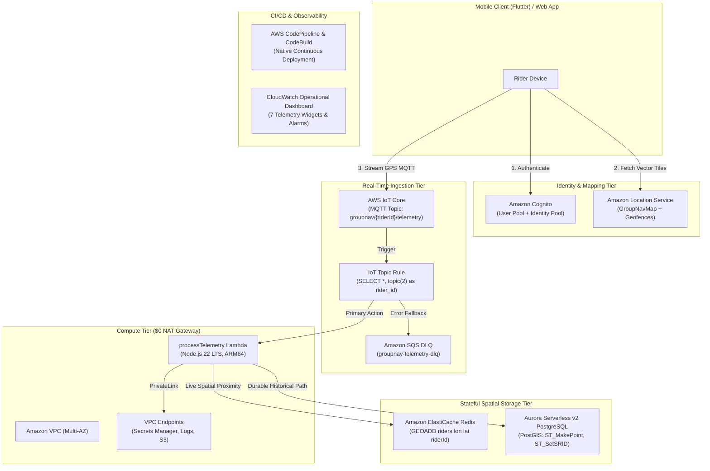

# GroupNav Infrastructure

<p align="center">
  <strong>Production-grade, real-time group location-tracking and geospatial telemetry infrastructure built on AWS with AWS CDK (TypeScript).</strong>
</p>

<p align="center">
  <a href="https://aws.amazon.com/cdk/"></a>
  <a href="https://www.typescriptlang.org/"></a>
  <a href="https://nodejs.org/"></a>
  <a href="test/"></a>
  <a href="LICENSE"></a>
  <a href="#-the-6-infrastructure-stacks"></a>
</p>

---

## 📑 Table of Contents

- [Overview](#-overview)
- [Why GroupNav Infrastructure?](#-why-groupnav-infrastructure)
- [Architecture Overview](#-architecture-overview)
- [The 6 Infrastructure Stacks](#-the-6-infrastructure-stacks)
- [Getting Started](#-getting-started)
  - [Prerequisites](#prerequisites)
  - [Installation & Setup](#installation--setup)
  - [Synthesizing & Deploying Stacks](#synthesizing--deploying-stacks)
  - [Exporting Client Configuration](#exporting-client-configuration)
- [Usage Examples](#-usage-examples)
  - [1. Mobile Client Telemetry Publishing (MQTT)](#1-mobile-client-telemetry-publishing-mqtt)
  - [2. Querying Spatial Proximity in Redis](#2-querying-spatial-proximity-in-redis)
  - [3. Historical Geospatial Analytics with PostGIS](#3-historical-geospatial-analytics-with-postgis)
- [Testing & Verification Runbooks](#-testing--verification-runbooks)
  - [Automated Unit Tests](#automated-unit-tests)
  - [Cloud Verification Scripts](#cloud-verification-scripts)
- [Repository Structure](#-repository-structure)
- [Documentation & Support](#-documentation--support)
- [Maintainers & Contributing](#-maintainers--contributing)
- [License](#-license)

---

## 🔭 Overview

**GroupNav Infrastructure** provides the cloud backend for real-time mobile group navigation and telemetry tracking (e.g., motorcycle convoys, cycling pelotons, delivery fleets, and off-road expeditions). 

Riders securely authenticate via **Amazon Cognito**, fetch vector map tiles and geofence collections via **Amazon Location Service**, and stream live GPS coordinates over MQTT directly into **AWS IoT Core**. Telemetry is ingested serverlessly by an ARM64 **AWS Lambda** function, cached in **Amazon ElastiCache Redis** for sub-millisecond proximity queries, and archived durably in **Amazon Aurora Serverless v2 PostgreSQL** with **PostGIS** spatial indexing.

---

## 💡 Why GroupNav Infrastructure?

- **⚡ Sub-Millisecond Spatial Lookups**: Ingests high-frequency GPS coordinates directly into Redis geospatial sorted sets (`GEOADD` / `GEOSEARCH`), allowing mobile apps to query "which riders are within 500 meters of me" in under 2ms.
- **🗺️ Durable PostGIS Spatial Analytics**: Automatically persists location histories into Aurora Serverless v2 PostgreSQL using `ST_SetSRID(ST_MakePoint(lon, lat), 4326)`, enabling route reconstruction and geofencing analytics.
- **💰 $0 NAT Gateway Operational Cost**: Replaces expensive NAT Gateways (~$32+/month per AZ) with VPC Gateway Endpoints (S3, DynamoDB) and targeted PrivateLink Interface Endpoints (Secrets Manager, CloudWatch Logs).
- **💤 Zero-Idle Compute Scaling**: Aurora Serverless v2 scales down to `0 ACUs` (auto-pause at 300 seconds idle), eliminating database idle costs during periods of inactivity.
- **🔐 Zero-Trust Direct Device Ingestion**: Riders authenticate directly against Cognito and exchange tokens for scoped IAM credentials, publishing straight to AWS IoT Core over TLS without custom proxy bottlenecks.
- **🛡️ Turnkey Fault Tolerance**: Every message that fails schema validation or database persistence is immediately routed to an Amazon SQS Dead-Letter Queue (DLQ) with 14-day retention.
- **🚀 100% AWS-Native CI/CD**: Cloud-native deployment pipeline via AWS CodePipeline and CodeBuild wired directly to GitHub.

---

## 🏛️ Architecture Overview

The system is designed around event-driven serverless ingestion, high-speed spatial caching, and decoupled cloud resources:



---

## 🧱 The 6 Infrastructure Stacks

The CDK application is organized into six isolated stacks to keep blast radiuses contained and avoid CloudFormation export deadlocks:

| Stack | Source File | Responsibilities & Resources |
|---|---|---|
| **`NetworkStack`** | [`lib/network-stack.ts`](lib/network-stack.ts) | Multi-AZ VPC (`10.0.0.0/16`) spanning 2 Availability Zones. Configures Public, Private Compute, and Isolated Data subnets. Creates `ComputeSG` and `DataSG` security groups. Configures S3 and DynamoDB Gateway Endpoints (**$0 NAT Gateway fee**). |
| **`AuthStack`** | [`lib/auth-stack.ts`](lib/auth-stack.ts) | Amazon Cognito User Pool with self-service sign-up, Identity Pool issuing short-lived IAM credentials, Amazon Location Service Map (`GroupNavMap`), and Geofence Collection (`GroupNavGeofenceCollection`). Scoped authenticated IAM policy for direct client tile access. |
| **`DataStack`** | [`lib/data-stack.ts`](lib/data-stack.ts) | Amazon ElastiCache Redis cluster (`cache.t4g.micro`) in isolated subnets for live spatial proximity caching. Aurora Serverless v2 PostgreSQL 16.8 cluster with PostGIS extension (`minCapacity: 0` auto-pause enabled at 300s, `maxCapacity: 1` ACU). AWS Secrets Manager for credentials. |
| **`ComputeStack`** | [`lib/compute-stack.ts`](lib/compute-stack.ts) | Serverless `processTelemetry` Lambda function (Node.js 22 LTS, Graviton ARM64) inside private compute subnets. PrivateLink VPC Interface Endpoints for Secrets Manager and CloudWatch Logs. AWS IoT Core Topic Rule with SQS Dead-Letter Queue (DLQ). |
| **`PipelineStack`** | [`lib/pipeline-stack.ts`](lib/pipeline-stack.ts) | **100% AWS-Native CI/CD**: AWS CodePipeline, AWS CodeBuild serverless project, encrypted S3 Artifact Bucket, and AWS CodeStar Connection linking directly to GitHub repository. |
| **`ObservabilityStack`** | [`lib/observability-stack.ts`](lib/observability-stack.ts) | CloudWatch Operational Dashboard (`GroupNav-Operational-Dashboard`) with 7 widgets tracking IoT traffic, DLQ depth, Lambda duration/errors, Redis CPU/memory, and Aurora ACU usage. Configures CloudWatch Metric Alarms and IoT Core CloudWatch Logging. |

---

## 🚀 Getting Started

### Prerequisites

Before deploying the infrastructure, verify your environment has the following installed:

- **Node.js**: `v18.x` or `v22.x LTS`
- **npm**: `v9.x` or higher
- **AWS CLI v2**: Configured with credentials that have Administrator/CDK deployment permissions:
  ```bash
  aws sts get-caller-identity
  ```
- **AWS CDK CLI**:
  ```bash
  npm install -g aws-cdk
  # or run via npx:
  npx cdk --version
  ```
- **Git**: For source control and CI/CD integration

---

### Installation & Setup

1. **Clone the repository**:
   ```bash
   git clone https://github.com/FaizanMominGit/GroupNav-Infrastructure.git
   cd GroupNav-Infrastructure
   ```

2. **Install project dependencies**:
   ```bash
   npm ci
   ```

3. **Compile TypeScript**:
   ```bash
   npm run build
   ```

4. **Bootstrap AWS CDK Environment** (required once per AWS Account / Region):
   ```bash
   npx cdk bootstrap aws://<ACCOUNT_ID>/<AWS_REGION>
   ```

---

### Synthesizing & Deploying Stacks

#### Synthesize CloudFormation Templates
Verify that all stacks synthesize cleanly without errors:
```bash
npx cdk synth
```

#### Deploy All Stacks
Deploy the complete infrastructure in correct dependency order:
```bash
npx cdk deploy --all --require-approval broadening
```

#### Deploy Stacks Selectively
You can also deploy stacks individually or in functional pairs:
```bash
# Phase 1: Deploy Network and Authentication Foundation
npx cdk deploy NetworkStack AuthStack

# Phase 2: Deploy Stateful Data Layer (Redis & Aurora PostGIS)
npx cdk deploy DataStack

# Phase 3: Deploy Ingestion Rule, DLQ, and Compute Lambda
npx cdk deploy ComputeStack

# Phase 4: Deploy Native CI/CD Pipeline and Observability Dashboard
npx cdk deploy PipelineStack ObservabilityStack
```

---

### Exporting Client Configuration

After deployment, extract all dynamic stack outputs (Cognito Pool IDs, Amazon Location Service ARNs, IoT Core endpoints, and SQS DLQ URLs) into a single client-facing JSON configuration file:

```bash
npm run export-config
```

This writes [`client-config.json`](client-config.json) to the repository root:

```json
{
  "region": "ap-south-1",
  "cognito": {
    "userPoolId": "ap-south-1_xxxxxxxxx",
    "userPoolClientId": "xxxxxxxxxxxxxxxxxxxxxxxxxx",
    "identityPoolId": "ap-south-1:xxxxxxxx-xxxx-xxxx-xxxx-xxxxxxxxxxxx"
  },
  "location": {
    "mapName": "GroupNavMap",
    "mapArn": "arn:aws:geo:ap-south-1:325313611329:map/GroupNavMap",
    "geofenceCollectionName": "GroupNavGeofenceCollection",
    "geofenceCollectionArn": "arn:aws:geo:ap-south-1:325313611329:geofence-collection/GroupNavGeofenceCollection"
  },
  "iot": {
    "endpoint": "xxxxxxxxxxxxxx-ats.iot.ap-south-1.amazonaws.com"
  },
  "compute": {
    "lambdaArn": "arn:aws:lambda:ap-south-1:325313611329:function:groupnav-process-telemetry",
    "dlqUrl": "https://sqs.ap-south-1.amazonaws.com/325313611329/groupnav-telemetry-dlq",
    "telemetryTopicPattern": "groupnav/{riderId}/telemetry"
  }
}
```

Mobile applications (e.g. Flutter or React Native) load this JSON artifact at startup to configure AWS Amplify, Amazon Location SDK, and MQTT connectivity.

---

## 💻 Usage Examples

### 1. Mobile Client Telemetry Publishing (MQTT)

Mobile clients publish live GPS telemetry over secure MQTT (port 8883) to the topic `groupnav/{riderId}/telemetry`:

```typescript
import mqtt from 'mqtt';

const client = mqtt.connect('mqtts://<iot-endpoint>:8883', {
  clientId: 'rider-mumbai-042',
  clean: true,
  reconnectPeriod: 5000,
});

client.on('connect', () => {
  const telemetry = {
    riderId: 'rider-mumbai-042',
    latitude: 19.0760,
    longitude: 72.8777,
    heading: 84.5,
    speed: 36.2,
    timestamp: Date.now(),
  };

  client.publish(
    'groupnav/rider-mumbai-042/telemetry',
    JSON.stringify(telemetry),
    { qos: 1 },
    (err) => {
      if (!err) console.log('Telemetry coordinate streamed successfully');
    }
  );
});
```

---

### 2. Querying Spatial Proximity in Redis

The `processTelemetry` Lambda writes real-time positions into Redis using geospatial sorted sets. To query all riders within a 5-kilometer radius of a given position:

```typescript
import { createClient } from 'redis';

const redis = createClient({ url: 'redis://<redis-endpoint>:6379' });
await redis.connect();

// Find riders within 5 km of (19.0760, 72.8777)
const nearbyRiders = await redis.geoSearch(
  'riders',
  { longitude: 72.8777, latitude: 19.0760 },
  { radius: 5, unit: 'km' },
  { SORT: 'ASC', WITHDIST: true, WITHCOORD: true }
);

console.log('Nearby riders:', nearbyRiders);
```

---

### 3. Historical Geospatial Analytics with PostGIS

Telemetry points are durably stored in Aurora PostgreSQL with PostGIS. To calculate total distance traveled by a rider during a trip:

```sql
SELECT 
  rider_id,
  COUNT(*) as total_pings,
  ST_Length(
    ST_MakeLine(location ORDER BY recorded_at)::geography
  ) / 1000.0 as distance_km
FROM rider_telemetry
WHERE rider_id = 'rider-mumbai-042'
  AND recorded_at >= NOW() - INTERVAL '24 HOURS'
GROUP BY rider_id;
```

---

## 🧪 Testing & Verification Runbooks

### Automated Unit Tests

The test suite validates infrastructure constraints across all 6 stacks (VPC subnets, security group ingress, scale-to-zero configurations, IAM policies, and Lambda environment variables):

```bash
npm test
```

> **Results**: 35 passed across 6 test suites (`test/network-stack.test.ts`, `test/auth-stack.test.ts`, `test/data-stack.test.ts`, `test/compute-stack.test.ts`, `test/pipeline-stack.test.ts`, `test/observability-stack.test.ts`).

---

### Cloud Verification Scripts

Execute live verification scripts against deployed AWS resources to validate functionality end-to-end:

| Script | Command | Validation Scope |
|---|---|---|
| **Phase 1 Verification** | `npx tsx scripts/verify-phase1.ts` | Registers test user in Cognito, exchanges tokens for AWS STS credentials, and fetches Amazon Location Service vector map tiles. |
| **Phase 3 Verification** | `npx tsx scripts/verify-phase3.ts` | Connects over MQTT to AWS IoT Core, publishes valid telemetry to verify Lambda triggering, and publishes invalid telemetry to verify SQS DLQ error routing. |
| **Phase 5 Verification** | `npx tsx scripts/verify-phase5.ts` | Queries CloudWatch API to verify dashboard widget metrics and confirms CloudWatch Alarms are active in `OK` state. |

---

## 📂 Repository Structure

```
GroupNav-Infrastructure/
├── bin/
│   └── groupnav.ts                 # CDK App entrypoint instantiating the 6 stacks
├── lib/
│   ├── network-stack.ts            # Multi-AZ VPC, subnets, $0 NAT Gateway endpoints
│   ├── auth-stack.ts               # Cognito User/Identity Pools & Amazon Location
│   ├── data-stack.ts               # Redis & Aurora Serverless v2 PostGIS cluster
│   ├── compute-stack.ts            # IoT Topic Rule, DLQ, and processTelemetry Lambda
│   ├── pipeline-stack.ts           # 100% AWS-Native CodePipeline & CodeBuild CI/CD
│   └── observability-stack.ts      # CloudWatch Dashboard, Alarms, and IoT Logging
├── lambda/
│   └── process-telemetry/
│       └── index.ts                # Real-time telemetry ingestion handler (ARM64)
├── scripts/
│   ├── export-client-config.ts     # Generates client-config.json from CFN outputs
│   ├── verify-phase1.ts            # Live Cognito & Location Service verification
│   ├── verify-phase3.ts            # Live IoT Core MQTT & SQS DLQ verification
│   └── verify-phase5.ts            # Live CloudWatch Dashboard & Alarms verification
├── docs/                           # Comprehensive engineering documentation
│   ├── README.md                   # Master documentation index & sitemap
│   ├── infrastructure/             # AWS CDK Cloud Stacks (Steps 1–8)
│   ├── mobile/                     # Flutter Mobile Architecture & Features (Steps 1–6)
│   ├── ui/                         # UI Overhaul & Stitch Design System (Steps 1–6)
│   └── operations/                 # Operational Runbooks & Cost Management
├── test/                           # Jest CDK assertion test suites (35 tests)
├── client-config.json              # Exported dynamic infrastructure endpoints
├── CONTRIBUTING.md                 # Development workflow & contribution guide
├── GroupNav-Infrastructure-Plan.md # Core architectural plan & implementation order
├── TROUBLESHOOTING_LOG.md          # Failure modes, root cause analyses, and fixes
├── package.json                    # Dependencies and npm scripts
└── cdk.json                        # AWS CDK configuration and context
```

---

## 📖 Documentation & Support

Explore the complete engineering guides, architectural tradeoffs, and verification evidence:

- **[Master Documentation Index](docs/README.md)**
- **Cloud Infrastructure (`docs/infrastructure/`)**:
  - [Step 1: Multi-Stack Initialization](docs/infrastructure/STEP_1_HOW_AND_WHY.md)
  - [Step 2: Network Foundation & $0 NAT Fee Architecture](docs/infrastructure/STEP_2_HOW_AND_WHY.md)
  - [Step 3: Cognito Identity & Location Security](docs/infrastructure/STEP_3_HOW_AND_WHY.md)
  - [Step 4: Phase 1 Cloud Verification & Client Config Export](docs/infrastructure/STEP_4_HOW_AND_WHY.md)
  - [Step 5: Stateful Data Layer (Redis & Aurora Serverless v2 PostGIS)](docs/infrastructure/STEP_5_HOW_AND_WHY.md)
  - [Step 6: Telemetry Ingestion & Compute Pipeline](docs/infrastructure/STEP_6_HOW_AND_WHY.md)
  - [Step 7: AWS-Native CI/CD Pipeline](docs/infrastructure/STEP_7_HOW_AND_WHY.md)
  - [Step 8: CloudWatch Observability & Demo Guardrails](docs/infrastructure/STEP_8_HOW_AND_WHY.md)
- **Mobile Client Architecture (`docs/mobile/`)**:
  - [Step 1: Pack & Auth Decoupling](docs/mobile/STEP_1_PACK_AUTH_DECOUPLING_HOW_AND_WHY.md)
  - [Step 2: Real Hardware GPS & Mock Fallback](docs/mobile/STEP_2_REAL_HARDWARE_GPS_HOW_AND_WHY.md)
  - [Step 3: AWS IoT Core MQTT Integration](docs/mobile/STEP_3_AWS_IOT_MQTT_HOW_AND_WHY.md)
  - [Step 4: Pack Room Lifecycle & Solo Mode](docs/mobile/STEP_4_PACK_ROOM_LIFECYCLE_HOW_AND_WHY.md)
  - [Step 5: Trip Recording & GPX/GeoJSON Export](docs/mobile/STEP_5_TRIP_RECORDING_EXPORT_HOW_AND_WHY.md)
  - [Step 6: Final Functional App Integration](docs/mobile/STEP_6_FINAL_FUNCTIONAL_APP_HOW_AND_WHY.md)
- **UI Design System (`docs/ui/`)**:
  - [UI Refresh Overview & Architecture](docs/ui/UI_REFRESH_HOW_AND_WHY.md)
- **Operations & Runbooks (`docs/operations/`)**:
  - [Service Suspension & Restore Guide](docs/operations/SERVICE_SUSPENSION_AND_RESTORE_HOW_AND_WHY.md)
- **Reference Plans & Logs**:
  - [Architectural Blueprint & Deployment Plan](GroupNav-Infrastructure-Plan.md)
  - [Troubleshooting Log & Root Cause Analysis](TROUBLESHOOTING_LOG.md)

Need help or found a bug? Please check [TROUBLESHOOTING_LOG.md](TROUBLESHOOTING_LOG.md) or open an issue on [GitHub Issues](https://github.com/FaizanMominGit/GroupNav-Infrastructure/issues).

---

## 👥 Maintainers & Contributing

Maintained by **Faizan Momin** ([@FaizanMominGit](https://github.com/FaizanMominGit)).

Contributions, bug reports, and enhancements are welcome! Please review our [Contributing Guidelines](CONTRIBUTING.md) for details on branching strategy, coding standards, and how to submit pull requests.

---

## 📄 License

This project is licensed under the MIT License - see the [LICENSE](LICENSE) file for details.
